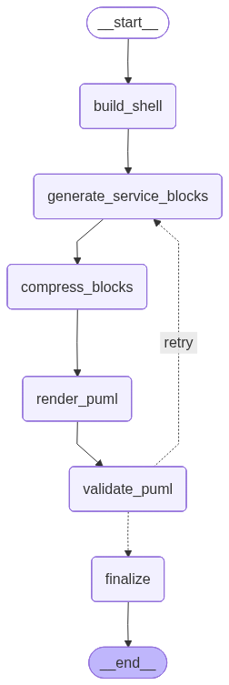

# puml_gen

Прототип генератора `PlantUML`-диаграмм из промежуточного IR роутов для FastAPI веб сервисов.

## Что делает проект

- принимает JSON IR как вход
- собирает workflow генерации через `LangGraph`
- генерирует `PlantUML activity`-диаграммы
- поддерживает два режима (пока работают похоже):
  - `route` — диаграмма роута, без погружения в технические детали
  - `service` — диаграмма роута, с более подробным кодом сервисных функции
- валидирует результат и при необходимости повторяет генерацию

## Визуализация графа



## Структура проекта

* `src/main.py` — CLI entrypoint
* `src/workflow.py` — сборка и выполнение графа генерации
* `src/generator.py` — генерация диаграмм
* `src/llm.py` — работа с LLM
* `output/` — сгенерированные диаграммы
* `diagrams/puml/` — примеры и готовые `.puml`
* `synthetic_data/` — тестовый IR
* `logs/` — логи генерации

## Как запускать

Установить зависимости:

```bash
make install
```

Базовый запуск:

```bash
make generate
```

Явный запуск:

```bash
python -m src.main \
  --input input/synthetic_data.json \
  --outdir output \
  --diagram-mode route
```

### Запуск через Docker (не пробовал)
добавить .env c:
```
OPENROUTER_API_KEY=your_key_here
OPENROUTER_MODEL=openai/gpt-4o-mini
OPENROUTER_BASE_URL=https://openrouter.ai/api/v1
```

команды для запуска:
```
docker compose up --build
docker compose run --rm puml-gen \
  python -m src.main --input input/synthetic_data.json --outdir output --diagram-mode service
```


## Входные данные

Сейчас проект работает с synthetic / intermediate IR в JSON-формате.
Основной сценарий — генерация activity-диаграмм по роутам и сервисным функциям.
В `routes` route-handler задаётся отдельно, а сервисные функции передаются как nested list в `service_function_groups`, даже если сейчас внутри только один `function_id`.

## Выходные данные

На выходе проект создаёт файлы `.puml`, которые можно дальше рендерить в изображения или использовать как артефакты документации.

## Технологии

* Python
* LangGraph
* LangChain
* PlantUML

## Логи

Логи запросов и ответов модели пишутся в:

```bash
logs/puml_gen.log
```
