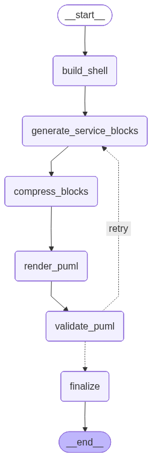

# puml_gen

FastAPI сервис для генерации `PlantUML activity`-диаграмм из промежуточного IR роутов.

## Что делает проект

- принимает JSON IR как HTTP request
- собирает workflow генерации через `LangGraph`
- генерирует `PlantUML activity`-диаграммы
- генерирует общую диаграмму роута и отдельные `.puml`-артефакты для каждой сервисной функции
- валидирует результат и при необходимости повторяет генерацию

## Визуализация графа



## Структура проекта

* `src/main.py` — FastAPI entrypoint
* `src/endpoints.py` — HTTP endpoint для генерации
* `src/workflow.py` — сборка и выполнение графа генерации
* `src/generator.py` — генерация диаграмм
* `src/llm.py` — работа с LLM
* `src/prompts.py` — fallback prompts и role-based prompt rendering
* `output/` — сгенерированные диаграммы
* `diagrams/puml/` — примеры и готовые `.puml`
* `synthetic_data/` — тестовый IR
* `logs/` — логи генерации

## Как запускать

Установить зависимости:

```bash
make install
```

Запуск сервера:

```bash
python -m src.main
```

POST endpoint:

```bash
POST /generate
```

## Конфиг LLM

Проект поддерживает два режима на каждый request:

- `model=openai/gpt-4o-mini`
- `model=local`

Пример `.env` для OpenRouter:

```bash
LLM=OPENROUTER
OPENROUTER_API_KEY=your_key_here
OPENROUTER_MODEL=openai/gpt-4o-mini
OPENROUTER_BASE_URL=https://openrouter.ai/api/v1
```

Пример `.env` для локальной модели через Ollama-compatible endpoint:

```bash
LLM=LOCAL
LOCAL_LLM_MODEL=your-local-model
LOCAL_LLM_BASE_URL=http://127.0.0.1:8080
LOCAL_LLM_CHAT_PATH=/api/chat
LOCAL_LLM_TIMEOUT_SECONDS=120
```

Если модель доступна только на удалённой машине, можно поднять туннель:

```bash
yc compute ssh --id epdtg3bfi4p4fg7mkutg -- \
  -vvv \
  -N \
  -L 8080:localhost:11434 \
  -o ExitOnForwardFailure=yes \
  -o ServerAliveInterval=30
```

После этого FastAPI сервис продолжит использовать локальную модель через настроенный endpoint.

### Запуск через Docker (не пробовал)

Команды для запуска:
```
docker compose up --build
docker compose run --rm puml-gen \
  python -m src.main --input input/synthetic_data.json --outdir output
```


## Входные данные

Сейчас проект работает с synthetic / intermediate IR в JSON-формате.
Основной сценарий — генерация activity-диаграмм по роутам и сервисным функциям.
В request передаются `input_path`, `model`, `messages`, `stream`, `options`.
`input_path` должен указывать на локальный synthetic `.json` файл.
В `routes` route-handler задаётся отдельно, а сервисные функции передаются как nested list в `service_function_groups`, даже если сейчас внутри только один `function_id`.

## Выходные данные

На выходе проект возвращает `routes` и `artifacts` в HTTP response, а также пишет общий файл роута `{route_slug}.activity.puml` и service-файлы `{route_slug}.{function_id_slug}.activity.puml` в `output/`.

## Технологии

* Python
* LangGraph
* LangChain
* PlantUML

## Логи

Логи запросов и ответов модели пишутся в:

```bash
logs/puml_gen.log
```
